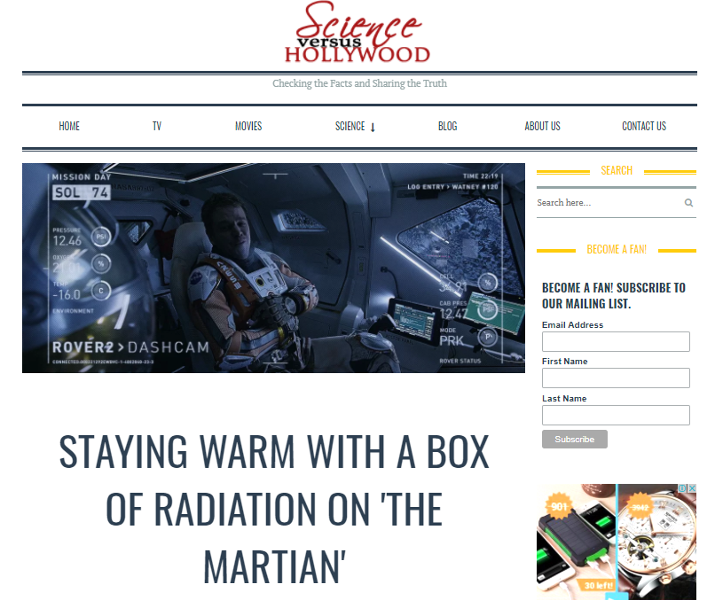
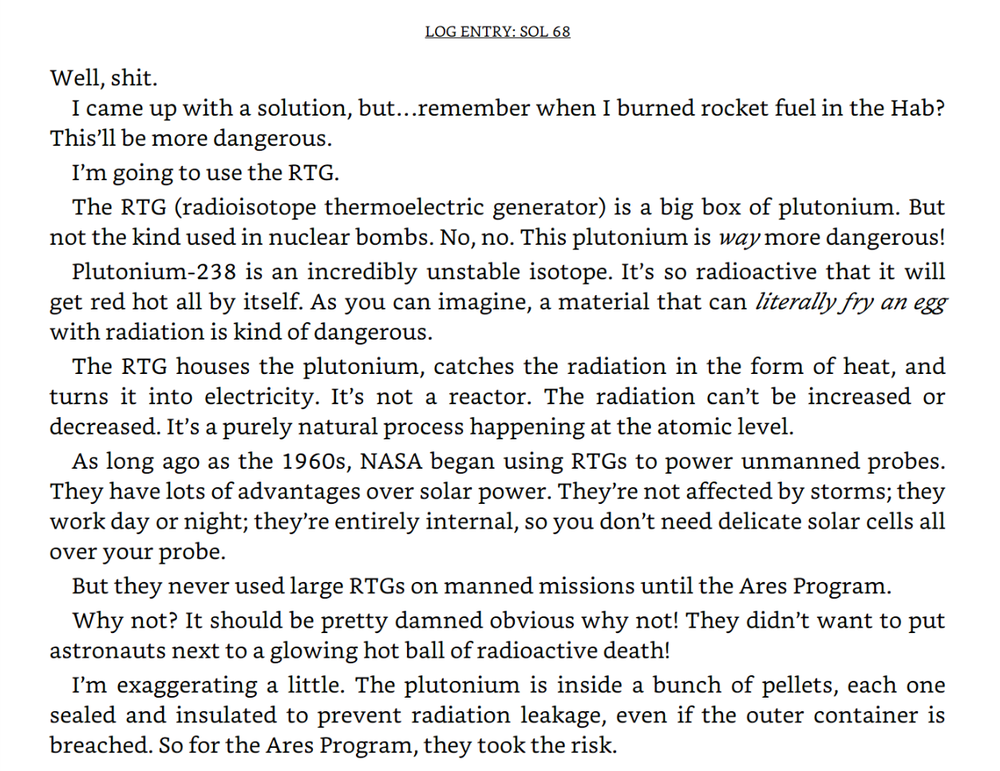
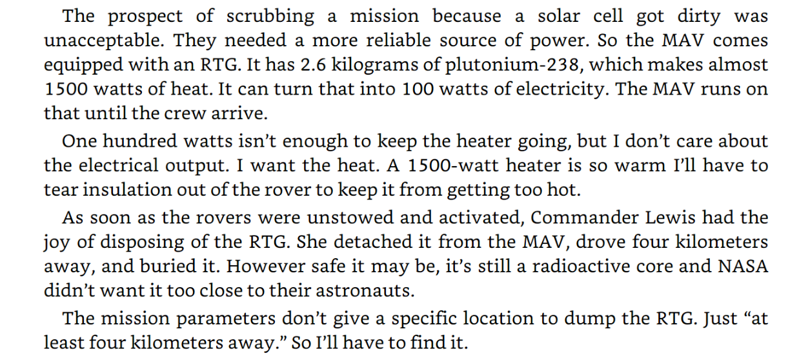
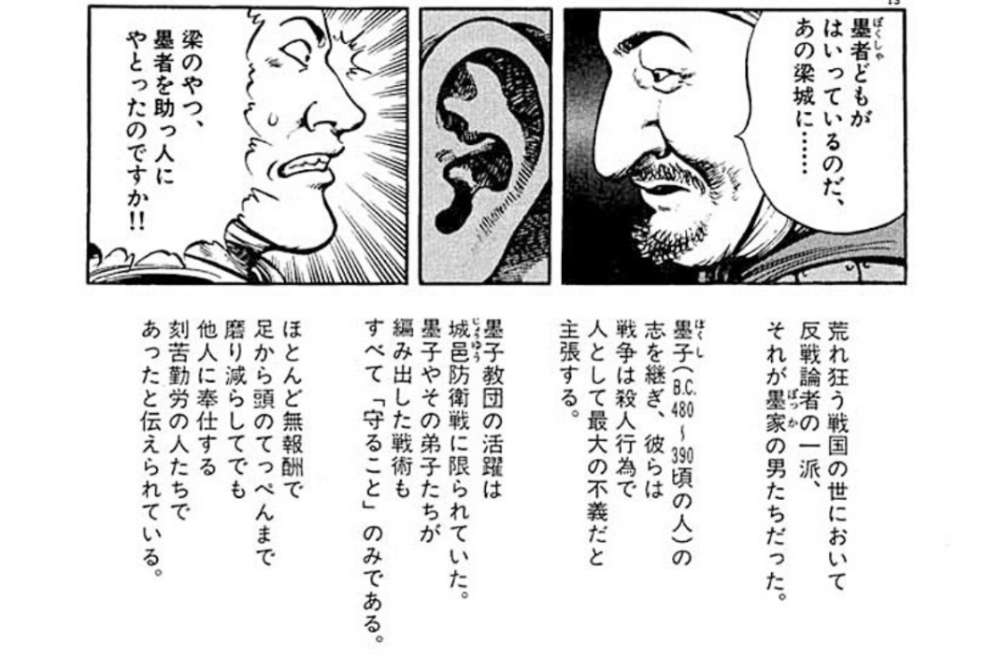
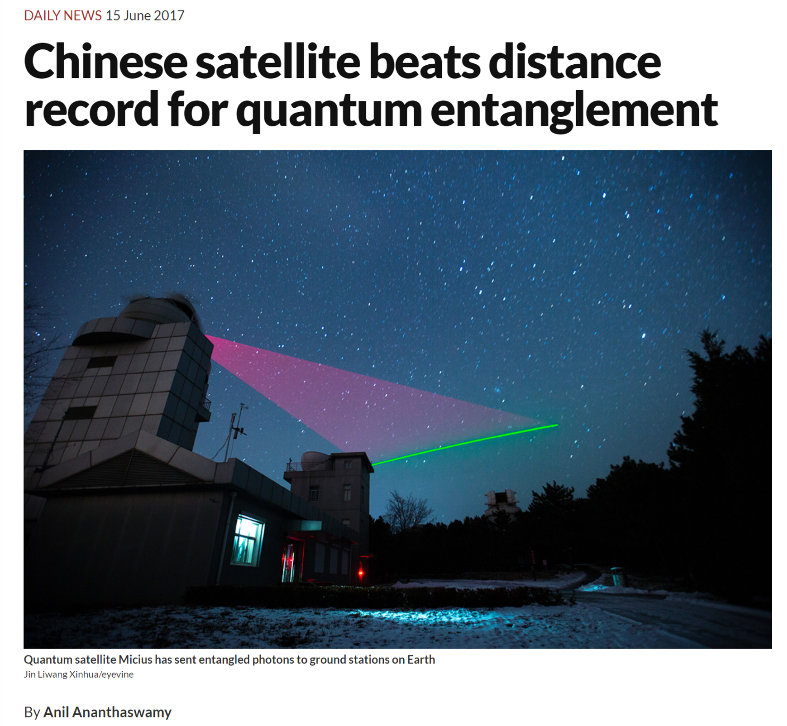
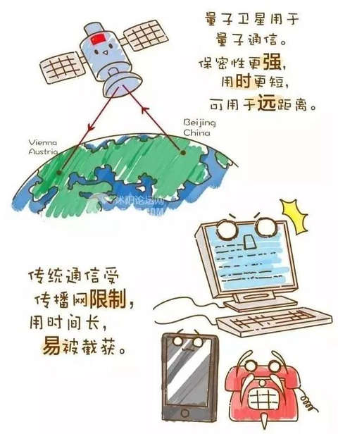
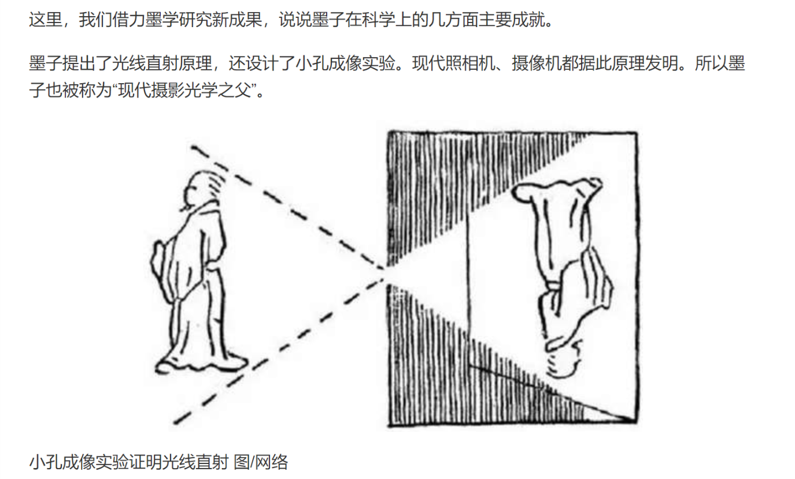
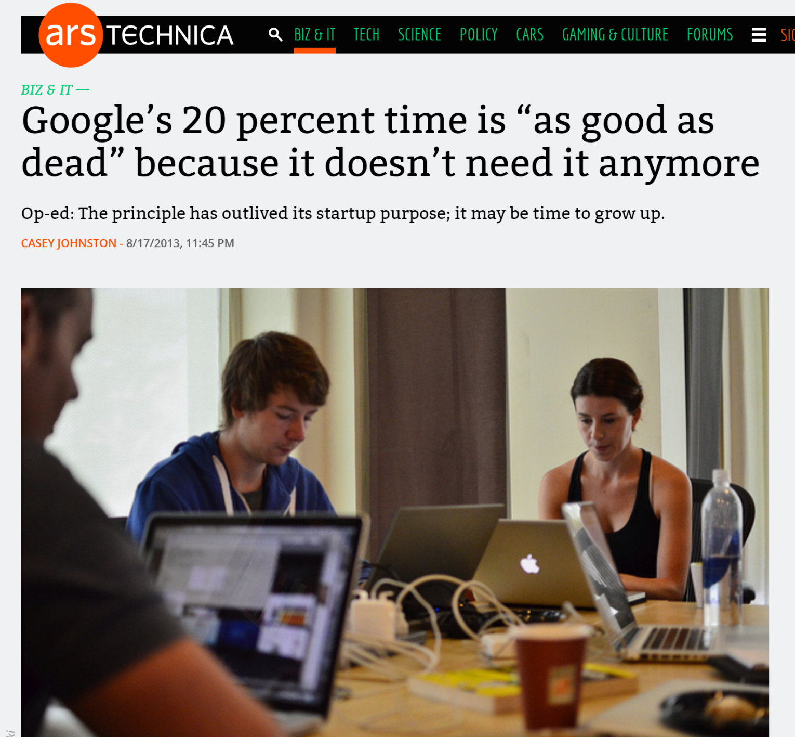

# 未来の色メモ

井川陽次郎

---

## Memo URL
- <a href="https://github.com/ged1959/SlideWithGitHubPages/blob/master/example/slide3.md" style="font-size:0.5em;">https://github.com/ged1959/SlideWithGitHubPages/blob/master/example/slide3.md</a>
- Chrome etc. ↓

--

## Slide URL
- <a href="http://ged1959.github.io/SlideWithGitHubPages/index.html?slide=example/slide3.md" style="font-size:0.5em;">http://ged1959.github.io/SlideWithGitHubPages/index.html?slide=example/slide3.md</a>

---

## The Martian

--

## The Martian "Alone!"

--

## The Martian movie
https://youtu.be/ej3ioOneTy8

--

## Book "The Martian"

<a href="https://www.amazon.co.jp/dp/B00EMXBDMA/ref=dp-kindle-redirect?_encoding=UTF8&btkr=1" style="font-size:0.5em;">Amazon\.co\.jp: The Martian: A Novel 電子書籍: Andy Weir: Kindleストア</a>

---

## Plutonium

--

## Plutonium Page

<a href="http://sciencevshollywood.com/staying-warm-with-a-box-of-radiation-on-the-martian/" style="font-size:0.5em;">Staying warm with a box of radiation on 'The Martian' \- Science vs Hollywood</a>

--

## RTG

<a href="https://www.amazon.co.jp/dp/B00EMXBDMA/ref=dp-kindle-redirect?_encoding=UTF8&btkr=1" style="font-size:0.5em;">Amazon\.co\.jp: The Martian: A Novel 電子書籍: Andy Weir: Kindleストア</a>

--

## RTG

<a href="https://www.amazon.co.jp/dp/B00EMXBDMA/ref=dp-kindle-redirect?_encoding=UTF8&btkr=1" style="font-size:0.5em;">Amazon\.co\.jp: The Martian: A Novel 電子書籍: Andy Weir: Kindleストア</a>

--

## RTG in "The Martian"

--

## Mars Temperature

---

## Curiosity@NASA

--

## Curiosity@NASA Power System

--

## Radioisotope Power Systems@NASA
- <a href="https://solarsystem.nasa.gov/rps/home.cfm">radioisotope power systems</a>
- <a href="https://mars.nasa.gov/msl/mission/technology/technologiesofbroadbenefit/power/">Power - Mars Science Laboratory</a>

---

## 映画「墨攻」

<a href="https://youtu.be/9ZDV1R-rfnk" style="font-size:0.5em;">https://youtu.be/9ZDV1R-rfnk</a>

--

## 墨攻（ぼっこう）

<a href="https://www.amazon.co.jp/%E5%A2%A8%E6%94%BB%EF%BC%88%E3%81%BC%E3%81%A3%E3%81%93%E3%81%86%EF%BC%89%EF%BC%88%EF%BC%91%EF%BC%89-%E3%83%93%E3%83%83%E3%82%B0%E3%82%B3%E3%83%9F%E3%83%83%E3%82%AF%E3%82%B9-%E4%B9%85%E4%BF%9D%E7%94%B0%E5%8D%83%E5%A4%AA%E9%83%8E-ebook/dp/B00KDAB2AE" style="font-size:0.5em;">墨攻（ぼっこう）（１） (ビッグコミックス) | 久保田千太郎, 酒見賢一, 森秀樹 | 青年コミック | Kindleストア | Amazon</a>

--

## 墨家とは

<a href="https://www.amazon.co.jp/%E5%A2%A8%E6%94%BB%EF%BC%88%E3%81%BC%E3%81%A3%E3%81%93%E3%81%86%EF%BC%89%EF%BC%88%EF%BC%91%EF%BC%89-%E3%83%93%E3%83%83%E3%82%B0%E3%82%B3%E3%83%9F%E3%83%83%E3%82%AF%E3%82%B9-%E4%B9%85%E4%BF%9D%E7%94%B0%E5%8D%83%E5%A4%AA%E9%83%8E-ebook/dp/B00KDAB2AE" style="font-size:0.5em;">墨攻（ぼっこう）（１） (ビッグコミックス) | 久保田千太郎, 酒見賢一, 森秀樹 | 青年コミック | Kindleストア | Amazon</a>

--

## 墨家の思想
- 防衛のための戦争は否定しない。
- 土木、冶金などの工学技術を磨く。
- 人間観察。
- 他国に侵攻された城の防衛に参加。

---

## 量子科学実験衛星「墨子」

<a href="https://www.newscientist.com/article/2134843-chinese-satellite-beats-distance-record-for-quantum-entanglement/" style="font-size:0.5em;">Chinese satellite beats distance record for quantum entanglement | New Scientist</a>

--

## 「墨子」衛星への期待

<a href="https://www.weibo.com/ttarticle/p/show?id=2309351000194010134840955719" style="font-size:0.5em;">中国发射全球首颗量子卫星，为何命名“墨子”？</a>

--

## なぜ「墨子」？

<a href="https://www.weibo.com/ttarticle/p/show?id=2309351000194010134840955719" style="font-size:0.5em;">中国发射全球首颗量子卫星，为何命名“墨子”？</a>

---

## Google 20%

<a href="https://arstechnica.com/information-technology/2013/08/googles-20-percent-time-is-as-good-as-dead-because-it-doesnt-need-it-anymore/" style="font-size:0.5em;">Google’s 20 percent time is “as good as dead” because it doesn’t need it anymore | Ars Technica</a>

---

## 伝言板

<a href="https://kaizuka-office.jimdo.com/%E4%BC%9D%E8%A8%80%E6%9D%BF/" style="font-size:0.5em;">伝言板・・・コメントをお書きください - 貝塚司法書士事務所（大阪・天満橋）ホームページ//司法書士香山恭慶・植木克明</a>

---
